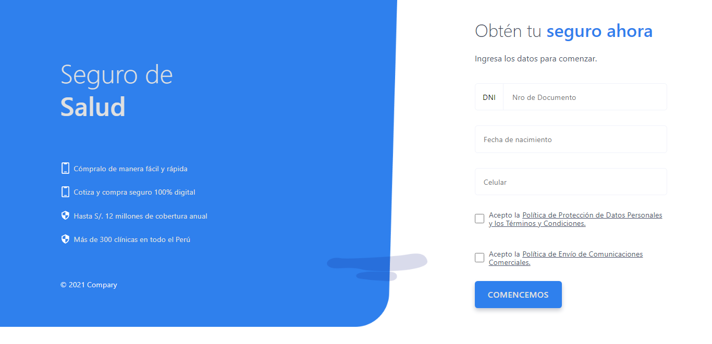
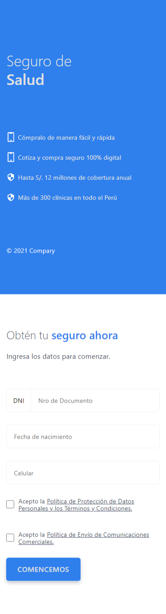
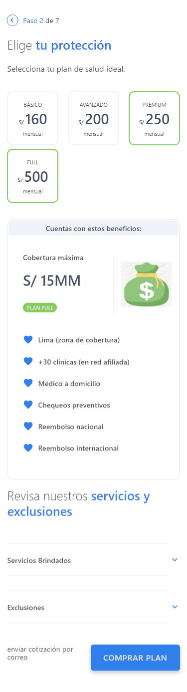

<h1 align="center">Cotizador Seguro de salud</h1>

<div align="center">
  <h3>
    <a href="https://cotizador-seguro-salud-sigma.vercel.app" target="_blank" >
      Demo
    </a>
  </h3>
</div>

<!-- TABLE OF CONTENTS -->

## 🔥 Table of Contents

- [Overview](#overview)
  - [Built With](#built-with)
- [How to use](#how-to-use)
- [Contact](#contact)
- [Acknowledgements](#acknowledgements)

<!-- OVERVIEW -->

## Overview

<details>
  <summary>💻 Desktop version</summary>




</details>

<details>
  <summary>📱 Mobile version</summary>




</details>

### Built With

- [Javascript](https://developer.mozilla.org/es/docs/Web/JavaScript)
- [Nextjs](https://nextjs.org/)
- [React](https://reactjs.org/)
- [React Hook Form](https://www.react-hook-form.com/)
- [Sass](https://sass-lang.com/)
- [SWR](https://swr.vercel.app/)
- [TypeScript](https://www.typescriptlang.org/)

## How To Use

To clone and run this application, you'll need [Git](https://git-scm.com) and [Node.js](https://nodejs.org/en/download/) (which comes with [npm](http://npmjs.com)) installed on your computer. From your command line:

```bash
# Clone this repository
$ git clone https://github.com/jcarlos0511/cotizador-seguro-de-salud.git

# Enter the created folder
$ cd cotizador-seguro-de-salud

# Install dependencies, if you use yarn => yarn install
$ npm install


# Run the app, yarn dev
$ npm run dev

# Visit http://localhost:3000/
```

## Acknowledgements

- [Next.js examples - GitHub](https://github.com/vercel/next.js/tree/canary/examples)
- [React TypeScript Cheatsheets](https://react-typescript-cheatsheet.netlify.app/)
- [Steps to replicate a design with only HTML and CSS](https://devchallenges-blogs.web.app/how-to-replicate-design/)
- [Marked - a markdown parser](https://github.com/chjj/marked)

## Contact

- GitHub [@jcarlos0511](https://github.com/jcarlos0511)
- Twitter [@jncarloschara](https://twitter.com/jncarloschara)
